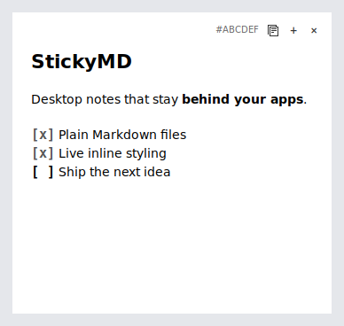

# StickyMD

**Your LLM said something useful. Again.**

LLMs kept producing answers worth keeping, but saving every result as a
Markdown file—and reopening an editor just to write a tiny summary—felt like
homework. I wanted a place to skim the output, jot down only the useful bit,
and get back to work.

StickyMD is that in-between place: small notes above the wallpaper and below
your real windows. Each note autosaves as a plain Markdown file, and one click
copies an exact reference you can hand back to any LLM or coding agent later.

The current release is a beta focused on GNOME. See the tested combinations in
[Requirements](#requirements) before installing.

> LLM output → skim → keep the useful bit → StickyMD → reference it later



## Features

- Multiple independently saved notes
- Live inline styling for `#` headings, `**bold**`, and task checkboxes
- Automatic saving and live reload after external file edits
- Position and size restoration across logins
- Move and resize from every edge or corner
- Login autostart and a small GNOME panel control for creating or stopping notes
- Recoverable deletion through the system Trash
- A hover action that copies an exact, agent-neutral note reference

## Requirements

StickyMD supports GNOME Shell 42–50 with a session-specific native backend:

| Session | GNOME Shell | Backend | Python requirement |
| --- | --- | --- | --- |
| Wayland | 45–50 | GNOME Shell desktop-layer actors | None |
| X11 | 42–49 | GTK 3 desktop windows | Python 3.9+ and PyGObject |

The X11 backend has been tested on Ubuntu 22.04 with GNOME Shell 42.9. The
Wayland backend has been live-tested on Ubuntu 24.04 with GNOME Shell 46. Other
declared Shell versions retain automated compatibility coverage. Other desktop
environments are not supported.

On Debian or Ubuntu, the X11 backend needs:

```bash
sudo apt install python3-gi gir1.2-gtk-3.0 libgtk-3-0
```

Wayland notes run inside GNOME Shell and do not use Python or GTK application
windows.

## Install

From the project directory:

```bash
./install.sh
~/.local/bin/stickymd
```

The installer writes only to the current user's home directory and does not use
`sudo`. It detects the active session and installs the matching Shell extension.
StickyMD then starts automatically on future logins and is available from the
GNOME application menu.

On Wayland and GNOME 45 or newer, log out and back in once after installation.
On GNOME 42–44 X11, press `Alt+F2`, enter `r`, and press Enter instead.

To update, run the installer again. Wayland extension updates require one logout
and login:

```bash
./install.sh
```

On X11, restart the GTK backend after updating:

```bash
stickymd quit
stickymd start
```

## Use

- Left-click the panel icon to create a note while StickyMD is running.
- Right-click the icon and choose **Quit StickyMD** to close every note and stop
  the background process without deleting content or state.
- When stopped, the panel icon becomes dim. Left-click it to start StickyMD and
  restore the registered notes without creating an extra note.
- Hover a note to reveal its reference, copy, `+`, and `×` controls.
- Click `+`, press `Ctrl+N`, or run `stickymd new` to create another note.
- Drag the empty top strip to move a note.
- Drag any edge or corner to resize it.
- Click `×` to move that note's Markdown file to Trash.
- Type `#`, `##`, or `###` headings and `**bold**` text to style them live.
- Type `- [ ]` or `- [x]` at the start of a line for a clickable checkbox.

Markdown remains directly editable in the same view. Syntax markers are shown
on the active line and hidden after the cursor moves elsewhere; there is no
separate preview mode. Unsupported Markdown stays ordinary text.

The same session-independent lifecycle commands are available from a terminal:

```bash
stickymd start
stickymd quit
```

Quitting is temporary for the current login session. Login autostart restores
registered notes the next time the desktop session starts. It never moves or
deletes note files; `×` remains the separate, recoverable delete action.

On Wayland, the notes are GNOME Shell actors inserted directly above the
wallpaper and below the compositor's application-window actors. On X11, the
same behavior comes from EWMH desktop-window hints. Neither backend uses
always-on-top.

The copy button creates a paste-ready request containing the note's first text
line, stable short reference, and exact file path:

```text
Read StickyMD note "Weekly plan" (#A1B2C3).
File: /home/user/StickyNotes/note-a1b2c3d4e5f6.md
```

## Data

Note content is plain UTF-8 Markdown:

```text
~/StickyNotes/note.md
~/StickyNotes/note-<stable-id>.md
```

Window positions and sizes are stored separately in:

```text
~/.local/state/simple-sticky/state.json
```

External edits appear in the matching open note automatically. Deleted notes
can be restored from GNOME Files Trash. If the system Trash is unavailable,
StickyMD uses `~/StickyNotes/.trash/`.

## Uninstall

```bash
./uninstall.sh
```

This removes the application and autostart integration but preserves notes and
state. To also remove active note files and state permanently:

```bash
./uninstall.sh --purge
```

System Trash and `~/StickyNotes/.trash/` are never emptied by the uninstaller.

## Development

Run the headless test suite with:

```bash
python3 -m unittest -v tests/test_simple_sticky.py
node --test tests/test_wayland_core.mjs
./tests/install_smoke.sh
```

GitHub Actions runs both backend test suites plus Python, modern and legacy
GNOME extension, installer, shell, and desktop-entry validation on every push
and pull request. Live compositor behavior remains part of the manual
verification record.

Maintainers can build the trimmed end-user release archive with:

```bash
./package-release.sh
```

The archive keeps the installer, application files, user documentation, and
screenshot while omitting tests, CI configuration, and implementation notes.

Separate Shell extension bundles for both generations can be built with:

```bash
./package-extensions.sh
```

Implementation details and the full verification record are in
[`IMPLEMENTATION_REPORT.md`](IMPLEMENTATION_REPORT.md). Release history is in
[`CHANGELOG.md`](CHANGELOG.md).
